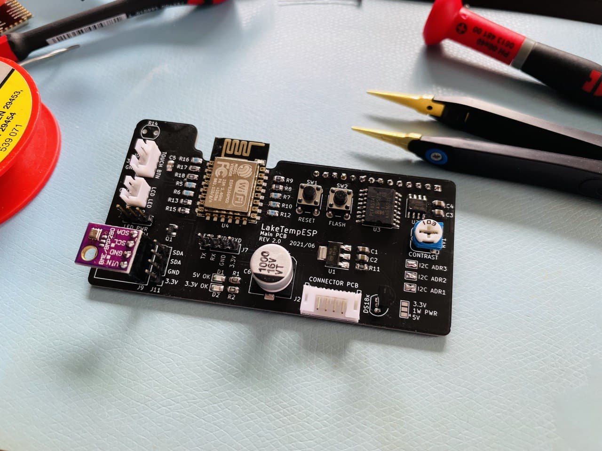
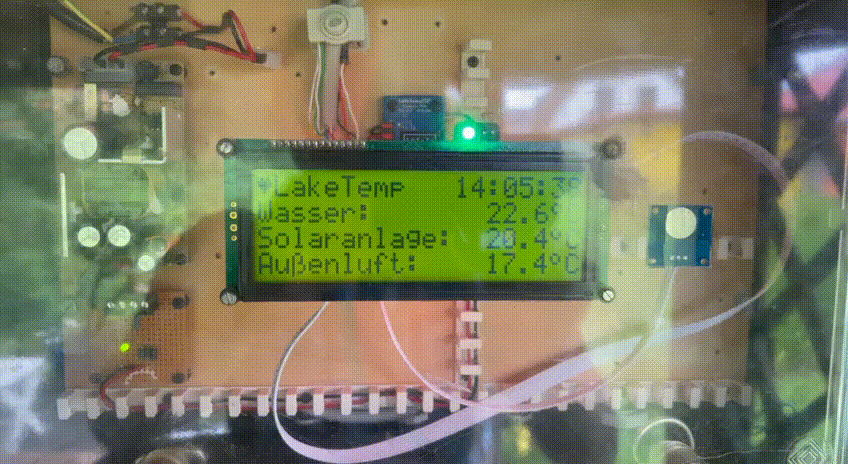
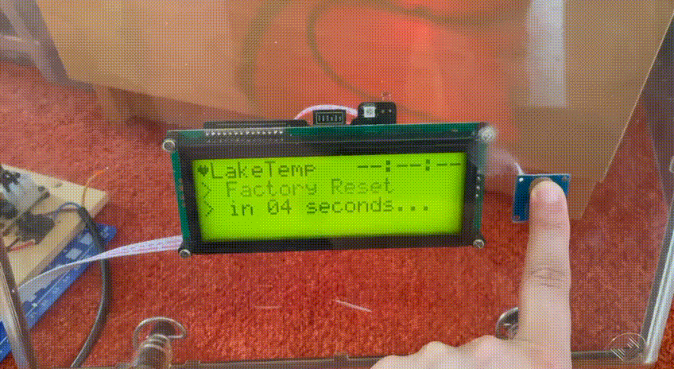
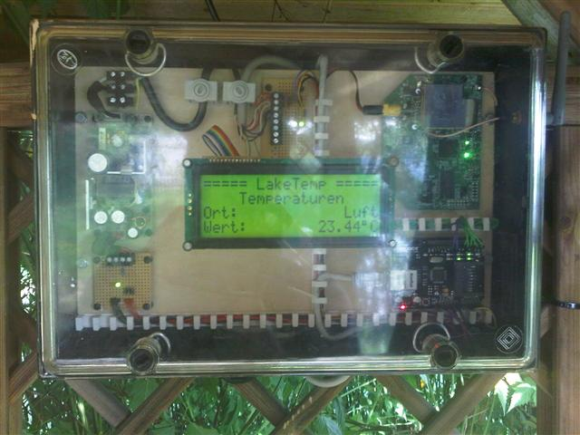

# LakeTempESP

WIP...

## Hardware 2021

## Hardware 2011-2021

One of my first electronic projects 2011 based on a breadboard. It has lasted almost 10 years of continuous operation.

- Arduino Uno
- Ethernet Shield (WIZnet W1500)
- BT42008 LCD (HD44780 4x20)
- WiFi AP in Client Mode
- 5V Power Suppy for the Arduino
- 12V Power Suppy for the AccessPoint

## ToDo
- [ ] Fix random HW/SW watchdog reboots while uploading data
- [ ] Use Light Sensor for nice things
- [x] Trigger data upload from WebUI
- [x] Show last und next upload on Dashboard
- [x] Add MAC Address to JSON Msg
- [x] Flash/Blink LED on Upload
- [x] Flash/Blink LED on Button press
- [x] Fade LED in Idle State